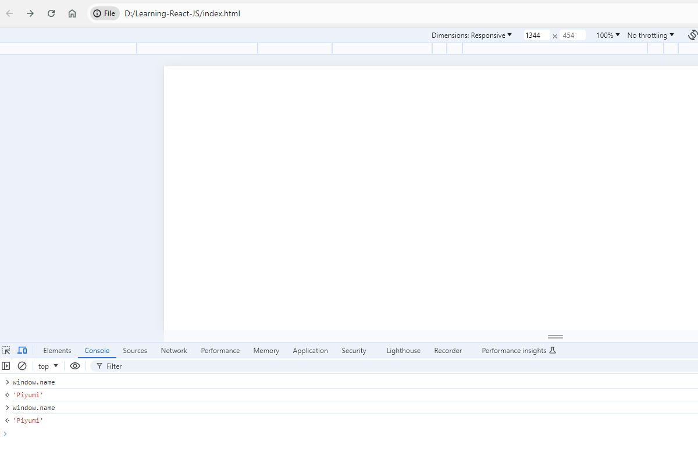
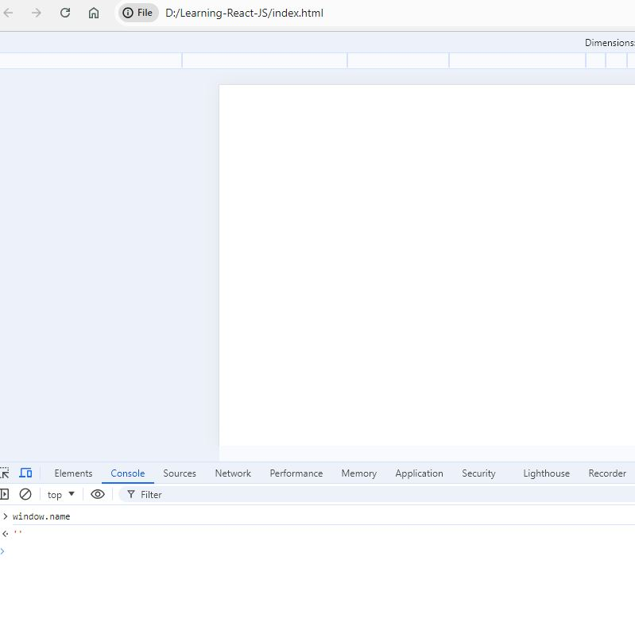

# Learning-React-JS

This repository contains the exercises done by me during the Udemy course "React JS Frontend Web Development for Beginners" by Ryan Dhungel. 

Link to the course is [here.](https://www.udemy.com/share/101rkI3@zMJhoBQX62DEpDKqhDh4Nq8DCl1wR1sLTXoIBZfNaJEtlFf0DKuzaPrA6jxET6DPOA==/)

## Variable types

There are 2 variable types.
1. const
2. let

If the variable value is not to be changed overtime, the _const_ is to be used. Instead of `var name = 'Piyumi';` we can use `const name = 'Piyumi';` for the variable definition. 

```js
const name = 'Piyumi';
alert(name);
```

If the variable is only meant to be inside the scope that the variable has been defined, _let_ is being used. Below is an example. 

```js
if (true){
    var name = 'Piyumi';
}
alert(name)
```
Above code is works in javascript and pops out the name variable into the window. The variable can be accessed and valid inside the whole code. Below is the console image that to prove that the variable can be accessed from outside of the _if_ statement. 



If _let_ is used, the variable name is only accepted inside of the defined scope and the varibale name still can be used outside the defined statements. 

```js
if (true){
    let name = 'Piyumi';
    // alert(name);
}

alert(name);
```

Below image shows that the varibale cannot be accessed throught the _window_ which means that the variable is not valid outside the _if_ statement. 


