# Learning-React-JS

This repository contains the exercises done by me during the Udemy course "React JS Frontend Web Development for Beginners" by Ryan Dhungel. 

Link to the course is [here.](https://www.udemy.com/share/101rkI3@zMJhoBQX62DEpDKqhDh4Nq8DCl1wR1sLTXoIBZfNaJEtlFf0DKuzaPrA6jxET6DPOA==/)

# Modern Javascript

## Variable types

There are 2 variable types.
1. const
2. let

If the variable value is not to be changed overtime, the _const_ is to be used. Instead of `var name = 'Piyumi';` we can use `const name = 'Piyumi';` for the variable definition. 

```js
const name = 'Piyumi';
alert(name);
```

If the variable is only meant to be inside the scope that the variable has been defined, _let_ is being used. Below is an example. 

```js
if (true){
    var name = 'Piyumi';
}
alert(name)
```
Above code is works in javascript and pops out the name variable into the window. The variable can be accessed and valid inside the whole code. Below is the console image that to prove that the variable can be accessed from outside of the _if_ statement. 

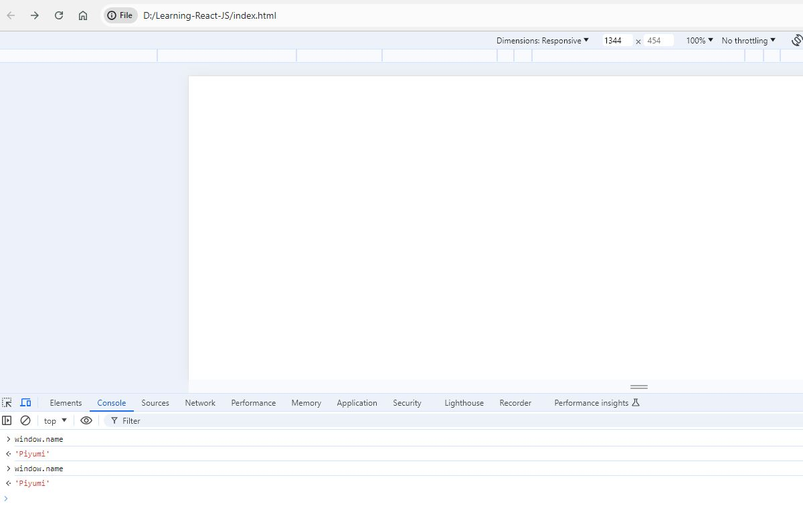

If _let_ is used, the variable name is only accepted inside of the defined scope and the varibale name still can be used outside the defined statements. 

```js
if (true){
    let name = 'Piyumi';
    // alert(name);
}

alert(name);
```

Below image shows that the varibale cannot be accessed throught the _window_ which means that the variable is not valid outside the _if_ statement. 

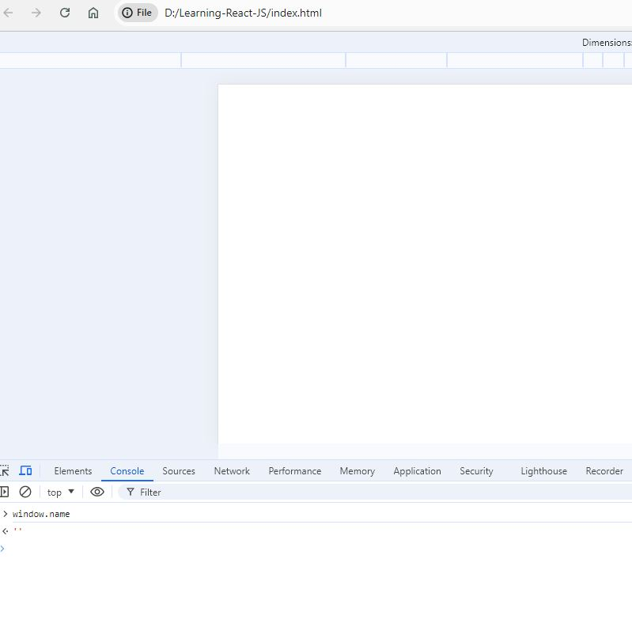

## Template strings

Template strings are used as an alternative for _string concatenation_. Here, the lecturer shows the old way of string concatenation and using the template strings. 

```js
let fname = 'Piyumi';
let lname = 'W';
let age = prompt("Guess Piyumi's age..");

// //old way
// let result = fname + ' ' + lname + ' '+ 'is ' + age + ' ' + 'years old.';
// alert(result);

//template strings
let result = `${fname} ${lname} is ${age} years old.`;
alert(result);
```
This method is useful in situations where we have to call URLs and endpoints from APIs. Both ways gives the same result as shown in below images. 

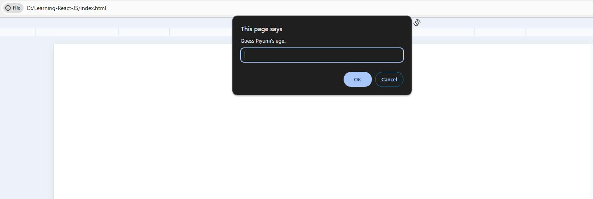
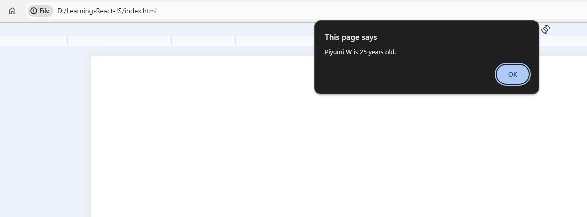

## Default parameters

This is an option of ES6 update to passing deafult parameters to function arguments and more. 

Define the function as below at first with no default values. 

```js
function welcome(user, message){
    alert(`Hello ${user}, ${message}`)
}

welcome('Piyumi', 'Welcome!')
```

The output is something like below. 

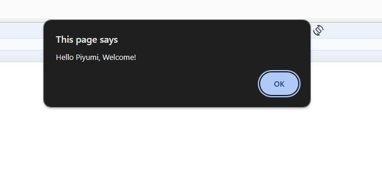

The output is generated as expected. But, if we call the function with no arguments as in `welcome()`, the output is generated as below. 

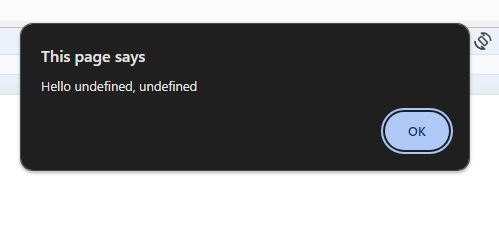

To avoid this situation, we define some default parameters when defining the function. 

```js
function welcome(user="mystery user", message="Good bye!"){
    alert(`Hello ${user}, ${message}`)
}
// welcome('Piyumi', 'Welcome!')
welcome();
```

When the function is called with no arguments, the output is generated with the default values. 

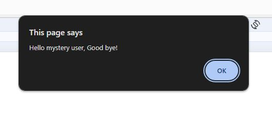

## Arrow function

These are different from the regular functions. The sample regular function looks like below. 

```js
function greeting(message){
    return alert(`${message} everyone`);
}

greeting("Good morning");
```

The same function can be written as an _arrow function_ like below. 

```js
let greeting = message => alert(`${message} everyone`);

greeting("Good morning");
```

The output is same for both of the ways. 

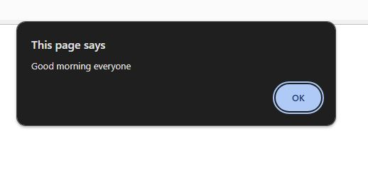

When there is only one input arguments, _message_ can be used without the paranthesis _( )_. Below is an another example with multiple arguments and statements.

```js
let createBlog = (title, body) => {
    if (!title) {
        throw new Error('A title is required');
    }
    if (!body) {
        throw new Error('Body cant be empty');
    }
    
    return alert(`${title} - ${body}`);
};

createBlog('new title', 'new body');
```

The output for above code is as follows. 

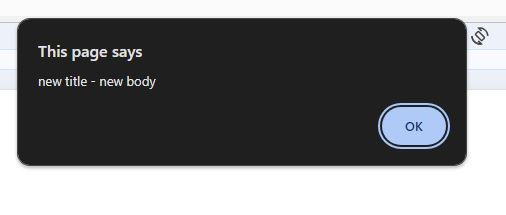

If there are no arguments, the arrow function can be defined as below. 

```js
let greeting = () => alert(`Hello everyone`);

greeting();
```

## Arrow function and _this_ function

In JavaScript when we create a function they become a part of the global _window_ object and when you use _this_ keyword it refers to the enclosing context. Using _this_ keyword ensures that it refers to the function within the function within the two curly braces. Below is an example where the function has become a method inside of the _window_ object and how the keyword _this_ has been used to directly access the _window_ object. 

***Before: ***

```js
function sayHi(){
    //
}

```
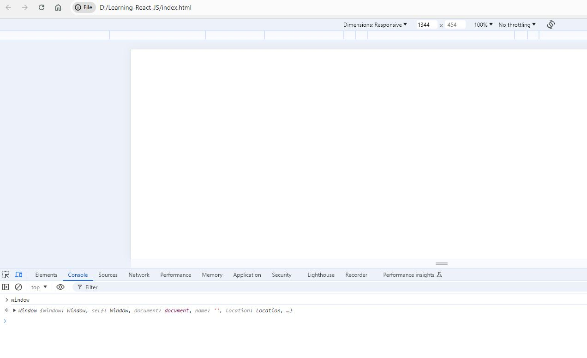

The window is not directly logged in the console window unless we look for it using the console. 

```js
function sayHi(){
    //
}

console.log(this);
```

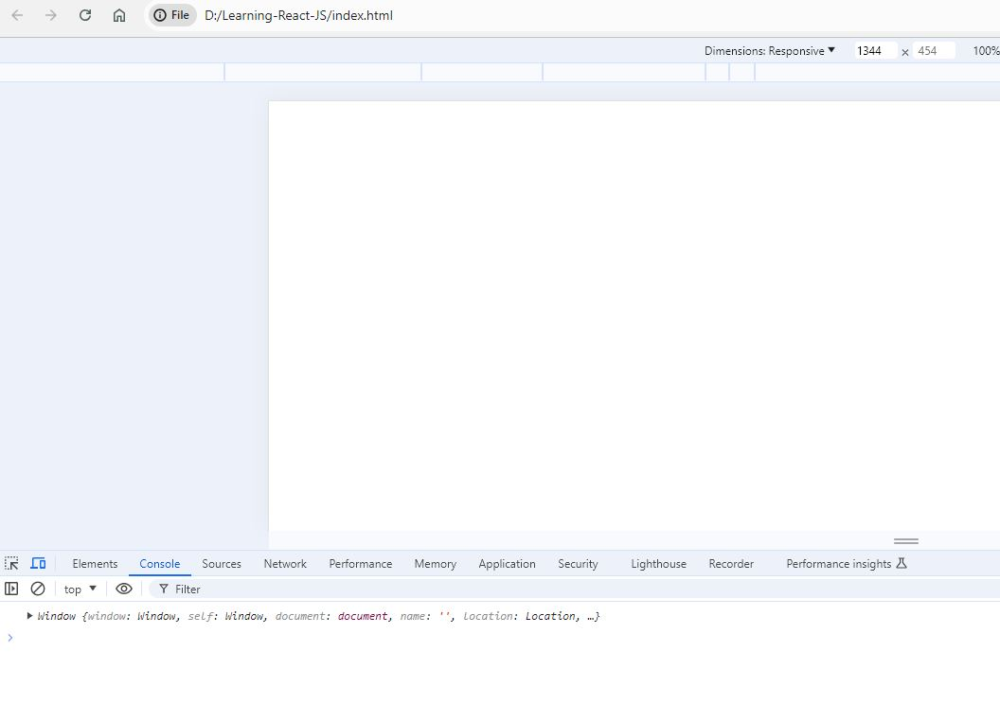

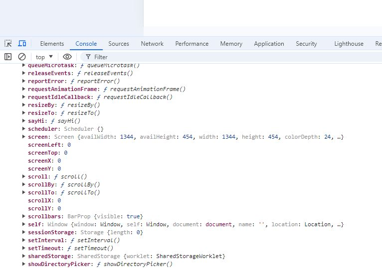

Here the _window_ is directly logged in the console and we can see the _sayHi_ function inside of it. 

The _this_ keyword should be used causiously. The contat of _this_ can be changed according to the place we out that into. Below examples shows how _this_ is acted accrding to the location and why it should not be used as such. 

```js
let nepal = {
    // add property
    mountains: ['Everest', 'Fish Tail', 'Annapurna'],

    // add method
    printWithDash: function() {
        console.log('Inside printWithDash', this)
        setTimeout(function() {
            // console.log(this.mountains.join(' - '))
            console.log('Inside setTimeout', this)
        }, 2000);
    }
}

nepal.printWithDash();
```

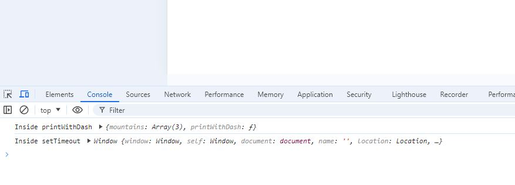

The definition of _this_ has been changed even though we used it inside the _nepal_ main object and same object _printWithDash_. This is where the usage of ***_arrow_*** function comes into the picture. Arrow function can help defining the keyword _this_ under a single whole function. 

```js
let nepal = {
    // add property
    mountains: ['Everest', 'Fish Tail', 'Annapurna'],

    // add method
    printWithDash: function() {
        // console.log('Inside printWithDash', this)
        setTimeout(() => console.log(this.mountains.join(' - ')), 2000)
            // console.log('Inside setTimeout', this)       
    }
}

nepal.printWithDash();
```

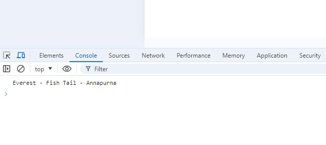

## Destructuring objects

This is a way of breaking down obects or arrays into variables. Below example shows how it works. 

```js
let thingsToDo = {
    morning: "Exercise",
    afternoon: "Work",
    evening: "Code",
    night: ["sleep", "dream"]
}

let {morning, afternoon} = thingsToDo; //object destructuring

console.log(morning, ' - ', afternoon)
```

The outout in the console shows that the _morning_ and _afternoon_ can be considered as seperate variables after the object destructuring.  

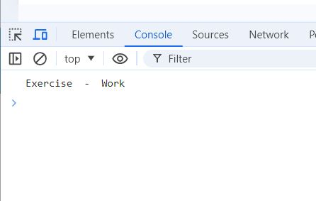

Below is a bit complex example.

**Method 1:**

```js
let uniStudent = student => {
    // let {name, university } = student;
    console.log(`${student.name} from ${student.university}`);
};

uniStudent({ 
    name: 'Piyumi',
    university: 'University of Oulu'
});
```

**Method 2:**

```js
let uniStudent = student => {
    let {name, university } = student;
    console.log(`${name} from ${university}`);
};

uniStudent({ 
    name: 'Piyumi',
    university: 'University of Oulu'
});
```

**Method 3:**

```js
let uniStudent = ({name, university }) => {
    console.log(`${name} from ${university}`);
};

uniStudent({ 
    name: 'Piyumi',
    university: 'University of Oulu'
});
```

All the methods generates the same output and the way of using can be selected as preferred. 

Output:

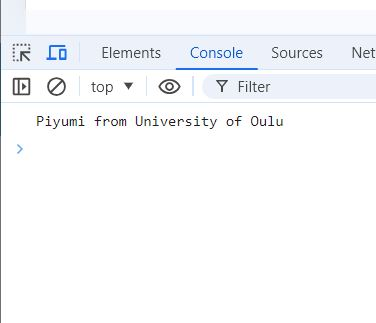

## Destructuring arrays

This is just like dealing with the destructuring objects in previous section. 

```js
// let [theMountain] = ['Everest', 'Fish Tail', 'Annapurna']; //choose the first element
// let [, theMountain] = ['Everest', 'Fish Tail', 'Annapurna']; //choose the second element
let [, , theMountain] = ['Everest', 'Fish Tail', 'Annapurna']; //choose the third element

console.log(theMountain)
```

The **' , '** defines the number of elements in the array that we need to skip. The output for each selection of the elements is as below. 

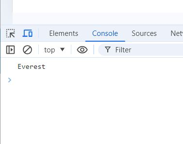
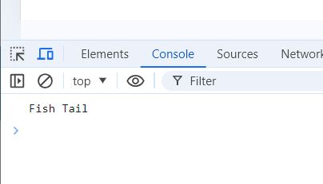
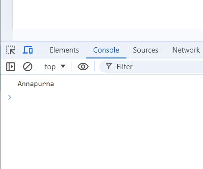

## Restructuring

Same as destructuring the object, we can restructure object from available variables. 

Below is an example of one way of doing it. The variables are restructured in the _var adventureClimbing_ object. 

```js
var name = 'Everest';
var height = 8848;
var output = function() {
    console.log(`Mt. ${this.name} is ${this.height} meters tall.`);
};

var adventureClimbing = { name, height, output };
adventureClimbing.output();
```

**Method 2:**

```js
var adventureClimbing = { 
    name: 'Everest', 
    height: 8848,
    output: function() {
    // or output() {
        console.log(`Mt. ${this.name} is ${this.height} meters tall.`);
    }
};
adventureClimbing.output();
```

The output of the restructuring eample is generated as below. 

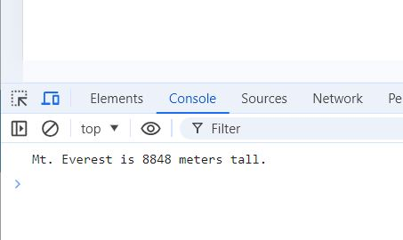

## Spread and rest operator

For this operator, resct JS uses `...`. This is used to combine two arrays of objects together. The first example shows that how it can be used in combining arrays. 

```js
var mountains = ['everest', 'Fish tail', 'Annapurna']
var mountainsInJapan = ['Fuji']

var allMountains = [...mountains, ...mountainsInJapan]
console.log(allMountains)
```

Output:

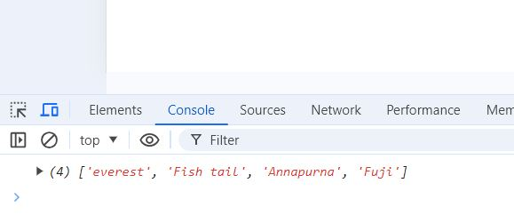

The example 2 shows how the spread operator work with the objects. 

```js
var day = {
    breakfast: 'toast with milk',
    lunch: 'rice with cicken curry'
}
var night = {
    dinner: 'noodle soup'
}

var picnic = {...day, ...night}
console.log(picnic)
```

Output:

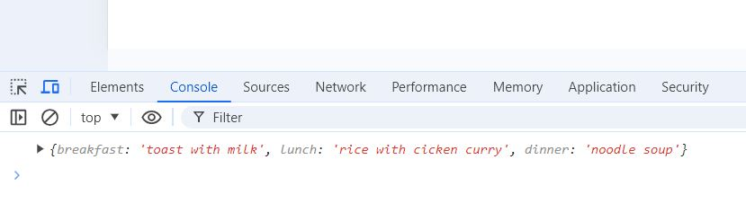

This methos is very useful in API calls. 

The below example shows how the operator can be used as _rest_ operator.

```js
var rivers = ['Sunkoshi', 'Tamakoshhi', 'Saptakoshi'];
var [first, ...rest] = rivers
console.log(first)
console.log(rest)
```

Output:

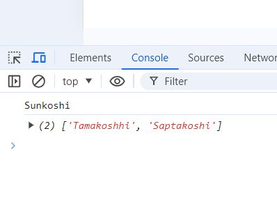

## Class, constructor and super

In early version of JS, the classes were not directly defined as classes. The classes were defined as functions (in JS function acts as an object) first, and then a method to that function was defined using ```prototype``` keyword, to introduce what does it do. The new variable under that function behaves according the _function_ and the _method_ defined. 

```js
function Holiday (destination, days) {
    this.destination = destination;
    this.days = days;
}

Holiday.prototype.info = function() {
    console.log(this.destination + " | " + this.days + " days");
};

var nepal = new Holiday("Nepal", 30);
console.log(nepal.info())
```

Output:

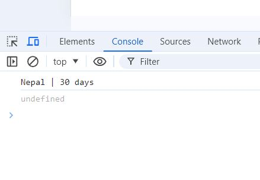

In next example it shows how _class_ cane be create a class with methods with properties. In below example, _constructor_ and _info_ are methods of the class and those have properties and arguments on its own. 

```js
class Holiday {
    constructor(destination, days) {
        this.destination = destination;
        this.days = days; 
    }
    
    info() {
        console.log(`${this.destination} will take ${this.days} days.`);
    }
}

const trip = new Holiday('Kathmandu, Nepal', 30); 
console.log(trip.info());
```

Output:

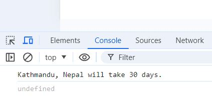

Below example shows how the classes can be extended into children classes. Child class has the same properties of the parent class. 

```js
// super class

class Holiday {
    constructor(destination, days) {
    this.destination = destination;
    this.days = days; 
    }
    info() {
    console.log(`${this.destination} will take ${this.days} days.`);
    }
}


// sub class

class Expedition extends Holiday {
    constructor (destination, days, gear) {
        super(destination, days);
        this.gear = gear;
    }
    info() {
        super.info();
        console.log(`Bring your ${this.gear.join(" and your ")} .`)
    }
}

const tripWithGear = new Expedition("Everest", 30, ["Sunglasses", "Flags", "Camera"]);
tripWithGear.info();
```

Output:

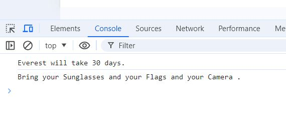

# React JS

## Installing React

1. Download and install Node. Download Node from [nodejs.org](https://www.nodejs.org/). 
2. Then go to the [react.org](https://www.react.org/). Start creating a react app using below commands. 

    ```cli
    npx create-react-app my-app
    ```

3. Then move into the `my-app` folder then type `npm start` to deploy the react web server. It will open a new window in powershell and also a new window in the web browser.

Web brower look:

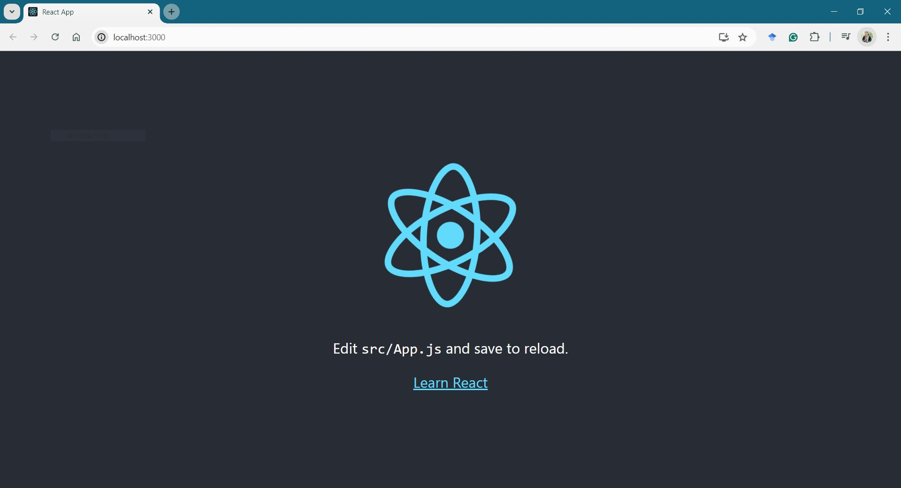

## React files and folders introduction

1. **Project Structure**: 
   - The project is located in the root directory inside a folder named "my-app".
   - The main working directory is the `src` (source) folder.

2. **Index.js**:
   - `index.js` is importing `React`, `ReactDOM`, `index.css`, `App`, and `reportWebVitals` which is a function used to measure the performance of the application.
   - `ReactDOM.createRoot`: This method is used to create a root DOM node where the React application will be rendered. It is a part of the new React 18 concurrent features.
   - `document.getElementById('root')`: This targets the div element with the id root in the index.html file, where the React app will be mounted.

3. **Public Folder**:
   - `index.html` contains a `div` with the id `root`, where the React application will be rendered.

4. **App Component**:
   - `App.js` imports `logo.svg`, and `App.css`.   
        * **Functional Component Definition**:
        ```javascript
        function App() {
        ```
        - `App` is defined as a functional component. Functional components are simple JavaScript functions that return JSX, a mixture of JavaScript and HTML-like syntax. JSX allows embedding JavaScript within HTML using curly braces `{}`.

        * **JSX Return**:
        ```javascript
        return (
            <div className="App">
            <header className="App-header">
        ```
        - The component returns a JSX structure. JSX is a syntax extension for JavaScript that looks similar to HTML and is used to describe what the UI should look like.

        * **Top-Level Container**:
        ```javascript
            <div className="App">
        ```
        - The component returns a `div` with the class name `App`. This `div` acts as the top-level container for the component.

        * **Header Section**:
        ```javascript
            <header className="App-header">
        ```
        - Inside the top-level `div`, there is a `header` element with the class name `App-header`. This section contains the main content of the component.

        * **Logo Image**:
        ```javascript
            
        ```
        - An `img` element is used to display the imported logo image. It uses `src={logo}` to set the source of the image, `className="App-logo"` for styling, and `alt="logo"` for accessibility.

        * **Edit Instructions**:
        ```javascript
            <p>
                Edit <code>src/App.js</code> and save to reload.
            </p>
        ```
        - A `p` (paragraph) element provides instructions to edit the `src/App.js` file and save to reload the application. The `<code>` element is used to style the file path as code.

        * **Learn React Link**:
        ```javascript
            <a
                className="App-link"
                href="https://reactjs.org"
                target="_blank"
                rel="noopener noreferrer"
            >
                Learn React
            </a>
        ```
        - An anchor (`a`) element provides a link to the React documentation. The link opens in a new tab (`target="_blank"`) and uses `rel="noopener noreferrer"` for security reasons. The `className="App-link"` is used for styling.

        * **Closing Tags**:
        ```javascript
            </header>
        </div>
        ```
        - The closing tags for the `header` and `div` elements wrap up the structure of the component.

5. **Live Reloading**:
   - Any changes made to the React components automatically reload the application, reflecting changes immediately.

## Storing data in component state via ajax call

Certainly! Here is the detailed explanation with thorough details filled in according to the given code:

### 1. **Cleanup and Preparation**
   - **Removed Unnecessary Imports, Components, and Hardcoded Data**: In transitioning from an example or initial setup, any unused imports, such as `React.Component`, `componentWillMount`, `constructor`, and hardcoded data, were removed. This streamlined the code and prepared it for dynamic data fetching.
   - **Decided to Make an API Call**: Instead of using dummy data which is common in initial setups or tutorials, the decision was made to fetch real data from an API. This approach mirrors a real-world scenario where data is often fetched from external sources.

### 2. **Installing Axios to Make the API Calls**
   - **Installed Axios**: Axios, a popular promise-based HTTP client, was chosen for making the API calls due to its ease of use and powerful features. It simplifies the process of making requests and handling responses in JavaScript.
   - **Installation Command**: To install Axios, the command `npm install axios` or `yarn add axios` was run in the terminal. This added Axios to the project dependencies, making it available for import and use in the project.

### 3. **Setting Up State**
   - **Introduced State in React**: The concept of state in React was introduced to manage data fetched from the API. State is a built-in object that allows components to create and manage their own data.
   - **Using `useState` Hook**: Instead of using a constructor as in class components, the `useState` hook was used to initialize the state. The `useState` hook takes an initial state value (an empty array in this case) and returns an array containing the state variable (`users`) and a function (`setUsers`) to update the state.

### 4. **Making the API Call**
   - **`useEffect` Hook**: The `useEffect` hook was utilized to handle side effects, such as fetching data. Unlike class components, functional components do not have lifecycle methods like `componentWillMount` or `componentDidMount`. Instead, `useEffect` provides a way to perform side effects in function components.
   - **API Call with Axios**: Inside `useEffect`, an Axios GET request was made to `https://api.randomuser.me/?nat=US&results=5` to fetch 5 random users from the US. The empty dependency array `[]` ensures that the effect runs only once, mimicking `componentDidMount` behavior.

### 5. **Handling the API Response**
   - **Using `.then` to Handle the Response**: The `.then` method was used to handle the promise returned by Axios. Once the data is fetched successfully, the response is logged to the console for debugging purposes.
   - **Updating the State**: The `setUsers` function (from `useState`) was used to update the `users` state with the fetched data. Specifically, `response.data.results` was extracted and set to the `users` state. Using `setState` or its equivalent ensures that React is aware of the state change and triggers a re-render of the component.

### 6. **Rendering Data**
   - **Initial Render Message**: The `return` statement within the functional component currently returns a simple `<div>` element with the text "We are back!". This can be expanded later to dynamically render the fetched user data.
   - **Future Data Rendering**: The next step would involve using the `users` state to dynamically render user data within the JSX. This can be done using array methods like `map` to iterate over the `users` array and generate corresponding UI elements for each user.
   - **React Developer Tools**: The state can be inspected using React Developer Tools, a browser extension that allows developers to inspect React component hierarchies and state. This helps confirm that the data has been fetched correctly and is being managed properly within the component.

Here is the code again for reference:
```js
import React, { useState, useEffect } from 'react';
import './App.css';
import axios from 'axios';

function App() {
  // state
  const [users, setUsers] = useState([]);

  useEffect(() => {
    axios('https://api.randomuser.me/?nat=US&results=5')
      .then(response => {
        console.log(response);
        setUsers(response.data.results);
      })
      .catch(error => console.error('Error fetching users:', error));
  }, []); // Empty dependency array means this effect runs once when the component mounts

  return <div className="App">We are back!</div>;
}

export default App;
```

Output:

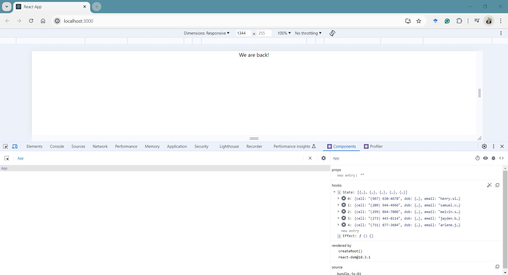

## Rendering state data using map

Here, we try to render users from users array in API using state. The code example is as follows.

```javascript
import React, { useState, useEffect } from 'react';
import './App.css';
import axios from 'axios';

function App() {
  // State to hold user data
  const [users, setUsers] = useState([]);

  // Fetching data from API
  useEffect(() => {
    axios('https://api.randomuser.me/?nat=US&results=5')
      .then(response => {
        setUsers(response.data.results);
      })
      .catch(error => console.error('Error fetching users:', error));
  }, []);

  return (
    <div className="App">
      {users.map(user => (
        <div key={user.login.uuid}>
          <p>{user.cell}</p>
          <p>{`${user.name.first} ${user.name.last}`}</p>
          <p>{user.email}</p>
        </div>
      ))}
    </div>
  );
}

export default App;
```

1. **Mapping Over State**:
   - Inside the `return` statement of the `App` component, we use JavaScript embedded in JSX by wrapping it in curly braces `{}`.
   - We call `users.map(user => ...)`, which iterates over the `users` array in the state and returns a new array of JSX elements for each user.

2. **Rendering User Details**:
   - For each user, we return a `<div>` element containing the user's cell phone, full name, and email.
   - We use `user.login.uuid` as a unique key for each user to help React identify which items have changed, are added, or are removed.

To improve the user experience while data is being fetched, we can introduce a loading state.

```javascript
import React, { useState, useEffect } from 'react';
import './App.css';
import axios from 'axios';

function App() {
  // State to hold user data and loading status
  const [users, setUsers] = useState([]);
  const [loading, setLoading] = useState(true);

  // Fetching data from API
  useEffect(() => {
    axios('https://api.randomuser.me/?nat=US&results=5')
      .then(response => {
        setUsers(response.data.results);
        setLoading(false);
      })
      .catch(error => {
        console.error('Error fetching users:', error);
        setLoading(false);
      });
  }, []);

  return (
    <div className="App">
      {loading ? (
        <p>Loading...</p>
      ) : (
        users.map(user => (
          <div key={user.login.uuid}>
            <p>{user.cell}</p>
            <p>{`${user.name.first} ${user.name.last}`}</p>
            <p>{user.email}</p>
          </div>
        ))
      )}
    </div>
  );
}

export default App;
```

1. **State for Loading**:
   - Introduced a new state variable `loading` initialized to `true`.
   - This state indicates whether the data is still being loaded.

2. **Updating Loading State**:
   - After fetching data successfully, we set `loading` to `false`.
   - If there's an error fetching data, we also set `loading` to `false` to stop the loading indicator.

3. **Conditional Rendering**:
   - If `loading` is `true`, we display a loading message.
   - Once loading is complete (`loading` is `false`), we map over the `users` array and render the user details.

To improve code maintainability, we can extract the API call logic into a separate function.

```javascript
import React, { useState, useEffect } from 'react';
import './App.css';
import axios from 'axios';

function App() {
  const [users, setUsers] = useState([]);
  const [loading, setLoading] = useState(true);

  // Function to fetch users
  const fetchUsers = () => {
    axios('https://api.randomuser.me/?nat=US&results=5')
      .then(response => {
        setUsers(response.data.results);
        setLoading(false);
      })
      .catch(error => {
        console.error('Error fetching users:', error);
        setLoading(false);
      });
  };

  useEffect(() => {
    fetchUsers();
  }, []);

  return (
    <div className="App">
      {loading ? (
        <p>Loading...</p>
      ) : (
        users.map(user => (
          <div key={user.login.uuid}>
            <p>{user.cell}</p>
            <p>{`${user.name.first} ${user.name.last}`}</p>
            <p>{user.email}</p>
          </div>
        ))
      )}
    </div>
  );
}

export default App;
```

1. **Extracted `fetchUsers` Function**:
   - Created a `fetchUsers` function to handle the API call and state updates.
   - Moved the API call logic from `useEffect` to `fetchUsers`.

2. **Calling `fetchUsers` in `useEffect`**:
   - In `useEffect`, we simply call `fetchUsers` to initiate the API call when the component mounts.

Output:


## Conditional rendering

The conditional rendering has been showcased in above code. A simple go through of the code is shown below. 

1. **State Management**:
   - Introduced a `loading` state along with the `users` state.
   - By default, set `loading` to `true` to indicate that data fetching is in progress.

2. **Setting Loading State**:
   - Before making the API call, set `loading` to `true` to indicate loading.
   - Once the API call completes, set `loading` to `false`.

3. **Conditional Rendering**:
   - Used a ternary operator to conditionally render the loading message or the list of users based on the `loading` state.


## Imports exports props

1. **Creating a Separate Component**:
   - Learn how to create a separate, reusable component in React.
   - Understand the difference between class components and functional components, and when to use each.
   - Focus on creating a stateless functional component for simplicity.

2. **Implementing the Loading Component**:
   - Create a simple `Loading` component that displays a loading message.
   - Use the `export default` statement for single-component exports.
   - Import and use the `Loading` component in the main `App` component.

3. **Conditional Rendering with the Loading Component**:
   - Apply conditional rendering in the `App` component to show the `Loading` component when data is being fetched.
   - Render the user list when the data fetching is complete.

4. **Exporting and Importing Components**:
   - Differentiate between default exports and named exports.
   - Understand how to import components using curly braces for named exports.

5. **Passing Props to Components**:
   - Learn how to pass data from a parent component to a child component using props.
   - Destructure props in the functional component for simplicity.
   - Pass dynamic messages or state data to the `Loading` component.

6. **Reusability of Components**:
   - Understand the importance of reusable components.
   - Create a flexible `Loading` component that can be used with different messages in different parts of the application.


A detailed guide in creating the import prop is shown below. 

1. Create a new file named `Loading.js` for the `Loading` component.

```javascript
// Loading.js
import React from 'react';

// Stateless functional component
const Loading = ({ message }) => {
  return <h2>{message}</h2>;
};

export default Loading;
```

2. Implementing the Loading Component

Import the `Loading` component in the `App` component.

```javascript
// App.js
import React, { useState, useEffect } from 'react';
import './App.css';
import axios from 'axios';
import Loading from './Loading';

function App() {
  const [users, setUsers] = useState([]);
  const [loading, setLoading] = useState(true);

  const fetchUsers = () => {
    setLoading(true);
    axios('https://api.randomuser.me/?nat=US&results=5')
      .then(response => {
        setUsers(response.data.results);
        setLoading(false);
      })
      .catch(error => {
        console.error('Error fetching users:', error);
        setLoading(false);
      });
  };

  useEffect(() => {
    fetchUsers();
  }, []);

  return (
    <div className="App">
      {loading ? (
        <Loading message="Loading..." />
      ) : (
        users.map(user => (
          <div key={user.login.uuid}>
            <p>{user.cell}</p>
            <p>{`${user.name.first} ${user.name.last}`}</p>
            <p>{user.email}</p>
          </div>
        ))
      )}
    </div>
  );
}

export default App;
```

3. Conditional Rendering with the Loading Component

Using the ternary operator, conditionally render the `Loading` component or the list of users based on the `loading` state.

4. Exporting and Importing Components

Example of exporting multiple components:

```javascript
// MultipleComponents.js
import React from 'react';

export const ComponentOne = () => <div>Component One</div>;
export const ComponentTwo = () => <div>Component Two</div>;
```

Importing named exports:

```javascript
// App.js
import { ComponentOne, ComponentTwo } from './MultipleComponents';
```

5. Passing Props to Components

Pass dynamic messages to the `Loading` component and destructure props directly in the function parameters.

```javascript
// Loading.js
import React from 'react';

// Stateless functional component with destructured props
const Loading = ({ message }) => {
  return <h2>{message}</h2>;
};

export default Loading;
```

```javascript
// App.js
import React, { useState, useEffect } from 'react';
import './App.css';
import axios from 'axios';
import Loading from './Loading';

function App() {
  const [users, setUsers] = useState([]);
  const [loading, setLoading] = useState(true);

  const fetchUsers = () => {
    setLoading(true);
    axios('https://api.randomuser.me/?nat=US&results=5')
      .then(response => {
        setUsers(response.data.results);
        setLoading(false);
      })
      .catch(error => {
        console.error('Error fetching users:', error);
        setLoading(false);
      });
  };

  useEffect(() => {
    fetchUsers();
  }, []);

  return (
    <div className="App">
      {loading ? (
        <Loading message="Fetching user data, please wait..." />
      ) : (
        users.map(user => (
          <div key={user.login.uuid}>
            <p>{user.cell}</p>
            <p>{`${user.name.first} ${user.name.last}`}</p>
            <p>{user.email}</p>
          </div>
        ))
      )}
    </div>
  );
}

export default App;
```

6. Reusability of Components

By passing different messages or data to the `Loading` component, it can be reused in different parts of the application.

```javascript
// AnotherComponent.js
import React from 'react';
import Loading from './Loading';

const AnotherComponent = () => {
  return (
    <div>
      <Loading message="Loading cart items..." />
    </div>
  );
};

export default AnotherComponent;
```

Output:

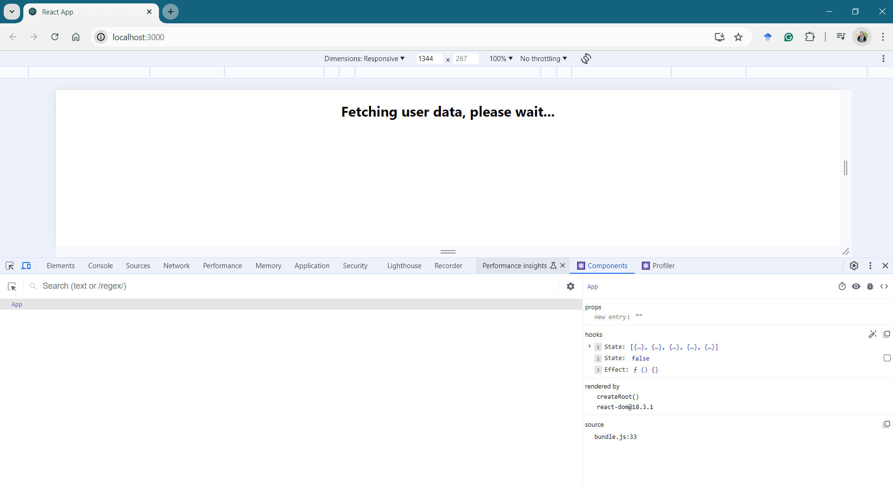


## Handling click events

The code can be go through step-by-step. 

1. **Adding a Form Element**:
  - Create a form with a submit button.
  - The form will have an input of type "submit" with the value "Load Users".
  - When the submit button is clicked, it will trigger a function to load more users.

2. **Handling Submit Event**:
  - Create a `handleSubmit` function to manage the form submission.
  - Prevent the default form submission behavior using `event.preventDefault()`.
  - Call the `fetchUsers` function within `handleSubmit` to load more users.
  - Log a message to the console for debugging.

3. **Binding Methods in Class Components**:
  - Bind the `handleSubmit` method in the constructor to ensure the correct `this` context.

4. **Fetching New Users**:
  - When the form is submitted, the `fetchUsers` function is called to load more users.
  - Merge the newly fetched users with the existing users in the state using the spread operator.
  - Update the state with the combined list of users.

5. **Preventing Page Reload**:
  - Ensure that the page does not reload when the form is submitted by correctly binding the event handler and using `event.preventDefault()`.

6. **Appending New Users**:
  - Append new users to the existing list in the state each time the "Load Users" button is clicked.
  - Use the spread operator to concatenate the existing users with the newly fetched users.

In below code, the form has been added with the handling component. 

```javascript
import React, { useState, useEffect } from 'react';
import axios from 'axios';
import './App.css';
import Loading from './Loading';

const App = () => {
  const [users, setUsers] = useState([]);
  const [loading, setLoading] = useState(true);

  const fetchUsers = () => {
    setLoading(true);
    axios.get('https://api.randomuser.me/?nat=US&results=5')
      .then(response => {
        setUsers(prevUsers => [...prevUsers, ...response.data.results]);
        setLoading(false);
      })
      .catch(error => {
        console.error('Error fetching users:', error);
        setLoading(false);
      });
  };

  useEffect(() => {
    fetchUsers();
  }, []);

  const handleSubmit = (event) => {
    event.preventDefault();
    fetchUsers();
    console.log('More users loaded.');
  };

  return (
    <div className="App">
      <form onSubmit={handleSubmit}>
        <input type="submit" value="Load Users" />
      </form>
      {loading ? (
        <Loading message="Loading users..." />
      ) : (
        users.map(user => (
          <div key={user.login.uuid}>
            <p>{user.cell}</p>
            <p>{`${user.name.first} ${user.name.last}`}</p>
            <p>{user.email}</p>
          </div>
        ))
      )}
    </div>
  );
};

export default App;
```

Each time the _load user_ button is pressed, 5 more users added to the fetched list.

## Destructuring, inline styling and keys

Here, the code is changed so that it can be cleaner to read and use. Object destructuring can still be relevant in the functional component code to simplify the handling of state and props. However, in the code provided, since the state is directly accessed through hooks, there isn't a need to destructure the state object as we would in a class component.

1. **Destructuring State in Functional Components**:
   - In functional components, state is often managed with hooks like `useState`. The destructuring of the state happens when you call `useState`, so there's no need to further destructure it within the component.

2. **Destructuring Props**:
   - If your functional component receives props, destructuring them at the beginning of your component can simplify the code. 

Here’s an example.

```javascript
import React, { useState, useEffect } from 'react';
import axios from 'axios';
import './App.css';
import Loading from './Loading';

const App = (props) => {
  const [users, setUsers] = useState([]);
  const [loading, setLoading] = useState(true); //Destructuring

  const fetchUsers = () => {
    setLoading(true);
    axios.get('https://api.randomuser.me/?nat=US&results=5')
      .then(response => {
        setUsers(prevUsers => [...prevUsers, ...response.data.results]);
        setLoading(false);
      })
      .catch(error => {
        console.error('Error fetching users:', error);
        setLoading(false);
      });
  };

  useEffect(() => {
    fetchUsers();
  }, []);

  const handleSubmit = (event) => {
    event.preventDefault();
    fetchUsers();
    console.log('More users loaded.');
  };

  return (
    <div className="App">
      <form onSubmit={handleSubmit}>
        <input type="submit" value="Load Users" />
      </form>
      {loading ? (
        <Loading message="Loading users..." />
      ) : (
        users.map(user => (
          <div key={user.login.uuid}> 
            <p>{user.cell}</p>
            <p>{`${user.name.first} ${user.name.last}`}</p>
            <p>{user.email}</p>
          </div>
        ))
      )}
    </div>
  );
};

export default App;
```

### Using Inline Styling:

Here’s how inline styling and the unique key is added to tha `App` component. In React, when rendering lists, each element must have a unique key prop. This helps React identify which items have changed, are added, or removed. This ensures each element in a list has a unique `key` prop to avoid warnings and improve performance.

```javascript
import React, { useState, useEffect } from 'react';
import axios from 'axios';
import './App.css';
import Loading from './Loading';

const App = () => {
  const [users, setUsers] = useState([]);
  const [loading, setLoading] = useState(true);

  const fetchUsers = () => {
    setLoading(true);
    axios.get('https://api.randomuser.me/?nat=US&results=5')
      .then(response => {
        setUsers(prevUsers => [...prevUsers, ...response.data.results]);
        setLoading(false);
      })
      .catch(error => {
        console.error('Error fetching users:', error);
        setLoading(false);
      });
  };

  useEffect(() => {
    fetchUsers();
  }, []);

  const handleSubmit = (event) => {
    event.preventDefault();
    fetchUsers();
    console.log('More users loaded.');
  };

  return (
    <div className="App">
      <form onSubmit={handleSubmit}>
        <input type="submit" value="Load Users" />
      </form>
      {loading ? (
        <Loading message="Loading users..." />
      ) : (
        users.map(user => (
            //Using unique keys
          <div key={user.login.uuid} style={{ border: '1px solid #ccc', padding: '10px', margin: '10px 0' }}>
            <p>{user.cell}</p>
            <p>{`${user.name.first} ${user.name.last}`}</p>
            <p>{user.email}</p>
          </div>
        ))
      )}
    </div>
  );
};

export default App;
```

Output:


# React Hooks

## React hooks and why we use class components

React introduced hooks in version 16.8 to address the limitations of functional components. Hooks are special functions that enable functional components to use state and other React features traditionally limited to class components. There are several benefits. 
    - Simplify component logic by avoiding the complexity of lifecycle methods.
    - Promote code reuse and composition through custom hooks.
    - Facilitate the use of functional components for all purposes, reducing the need to switch between functional and class components.

- **Class Components**:
  - Traditionally used for managing local component state and lifecycle methods.
  - Required for complex components with state and side effects before hooks were introduced.
  - Example of a class component managing state:
    ```javascript
    class Example extends React.Component {
      constructor(props) {
        super(props);
        this.state = {
          count: 0
        };
      }

      render() {
        return (
          <div>
            <p>You clicked {this.state.count} times</p>
            <button onClick={() => this.setState({ count: this.state.count + 1 })}>
              Click me
            </button>
          </div>
        );
      }
    }
    ```
  - Drawbacks:
    - Verbose syntax with constructors and lifecycle methods.
    - Complexity in handling state and side effects.
    - Harder to share and reuse logic between components.

- **Functional Components**:
  - Prior to hooks, they were stateless and used purely for presentational purposes.
  - Simplified syntax without the need for `this` keyword or lifecycle methods.
  - Hooks enable functional components to manage state and side effects, making them fully capable for all component logic.
  
- **useState Hook**:
  - Introduces state management in functional components.

    ```javascript
    const [state, setState] = useState(initialState);
    ```
  - Example:
    ```javascript
    import React, { useState } from 'react';

    function Example() {
      const [count, setCount] = useState(0);

      return (
        <div>
          <p>You clicked {count} times</p>
          <button onClick={() => setCount(count + 1)}>
            Click me
          </button>
        </div>
      );
    }
    ```
  - Advantages:
    - Simple and concise state management.
    - Enables multiple state variables within a single component.
  
- **useEffect Hook**:
  - Handles side effects in functional components, such as data fetching, subscriptions, and manual DOM manipulations.
  - Replaces lifecycle methods (`componentDidMount`, `componentDidUpdate`, and `componentWillUnmount`).
  - Syntax:
    ```javascript
    useEffect(() => {
      // Side effect logic here

      return () => {
        // Cleanup logic here (optional)
      };
    }, [dependencies]);
    ```
  - Example:
    ```javascript
    import React, { useEffect, useState } from 'react';

    function Example() {
      const [count, setCount] = useState(0);

      useEffect(() => {
        document.title = `You clicked ${count} times`;

        return () => {
          // Optional cleanup logic
        };
      }, [count]); // Dependency array

      return (
        <div>
          <p>You clicked {count} times</p>
          <button onClick={() => setCount(count + 1)}>
            Click me
          </button>
        </div>
      );
    }
    ```
  - Advantages:
    - Consolidates side effect logic in one place.
    - Simplifies component lifecycle management.
    - Enables better organization and cleanup of side effects.

**Benefits of Using Hooks:**
  - Hooks drastically reduce boilerplate code by eliminating the need for class component syntax.
  - State and side effects are managed within functional components, streamlining the development process.
  - Code readability and maintenance are improved through clearer and more concise component logic.
  - Hooks facilitate the use of modern JavaScript features like destructuring and arrow functions.

## Counter app using class

Code:

```js
//App.js

import React, { Component } from "react";
  class App extends Component {
    state = {
      count: 0
    };
    increment = () => {
      this.setState({
        count: this.state.count + 1
      });
    };
  
    render() {
      return (
        <div>
          <h2>counter app</h2>
          <button onClick={this.increment}>
            Clicked {this.state.count} times
          </button>
        </div>
      );
    }
  }

export default App;
```

In the output window, every time the button is clicked, the number increases by one. 

Output:


## useState hook

In this section, the same program in previous section will be written with _useState_ hook and compare the changes. Initially, the counter app was written as a class component that managed state with `this.state` and updated state using `this.setState`. This will demonstrate how to convert this to a functional component by utilizing the `useState` hook. 

The `useState` hook allows functional components to manage state without the need for class syntax. A state variable `count` and a function `setCount` is declared to update this state, simplifying the state management process. Additionally, an increment method using `setCount` is created to update the `count` value. This refactoring eliminated the need for `this` keyword and lifecycle methods, streamlining the code significantly. The functional component was then rendered with a simple `return` statement, making the code more concise and readable. 

Code:

```js
import React, { Component, useState } from "react";

const App = () => {
  const [count, setCount] = useState(0)

  const increment = () => {
    setCount(count + 1)
  }

return (
  <div>
    <h2>Counter app</h2>
    <button onClick={increment}>Clicked {count} times</button>
  </div>
); 
}

export default App;
```

## useEffect hook

Here, we explore the use of the `useEffect` hook to handle side effects in functional components, replacing the lifecycle methods `componentDidMount` and `componentDidUpdate` used in class components. Side effects in React refer to actions like updating the document title or fetching data when the state changes. To illustrate this, we edut the previous code to update the document title based on a counter's value.

Initially, we demonstrate the class component approach by creating two lifecycle methods: `componentDidMount` to set the document title when the component mounts, and `componentDidUpdate` to update the title whenever the state changes. This involved writing multiple lifecycle methods to achieve the desired functionality.

Next, we refactore the class component into a functional component using the `useEffect` hook. The `useEffect` hook takes a function as an argument and runs this function every time the component updates. We used it to update the document title whenever the counter's state changed. This approach simplified the code, as we no longer needed multiple lifecycle methods; instead, we used a single hook to handle the side effects.

Both class component program and functional component program is added for the reference. 

```js
import React, { Component, useState, useEffect } from "react";

const App = () => {
  const [count, setCount] = useState(0)

  useEffect(() => {
    document.title = `Clicked ${count} times`
  })

  const increment = () => {
    setCount(count + 1)
  }

return (
  <div>
    <h2>Counter app</h2>
    <button onClick={increment}>Clicked {count} times</button>
  </div>
); 
}

// class App extends Component {
//   state = {
//     count: 0
//   };
//   increment = () => {
//     this.setState({
//       count: this.state.count + 1
//     });
//   };

//   componentDidMount() {
//     document.title = `Clicked ${this.state.count} times`
//   }

//   componentDidUpdate() {
//     document.title = `Clicked ${this.state.count} times`
//   }

//   render() {
//   return (
//     <div>
//       <h2>counter app</h2>
//       <button onClick={this.increment}>
//         Clicked {this.state.count} times
//       </button>
//     </div>
//   );
//   }
// }

export default App;
```

Output:

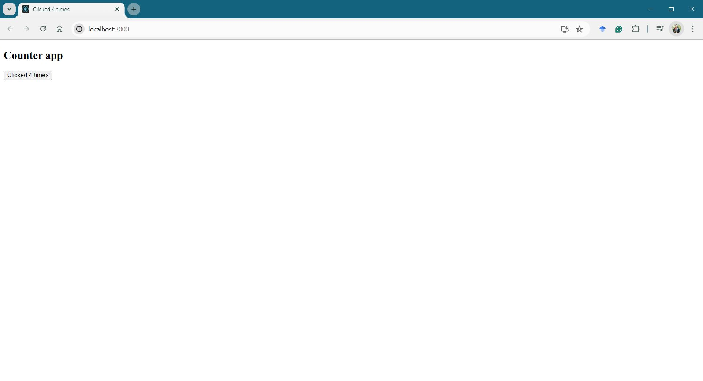

## News app using hooks

This provides a concise breakdown of creating a Hacker News client using React hooks, showcasing the use of `useState` and `useEffect` to manage state and side effects efficiently in a functional component.


1. **Create a Functional Component**
   ```javascript
   const App = () => {
     // state
   };
   ```

2. **Initialize State with useState Hook**
   ```javascript
   const [news, setNews] = useState([]);
   ```

3. **Write fetchNews Method**
   ```javascript
   const fetchNews = () => {
    fetch("http://hn.algolia.com/api/v1/search?query=react")
      .then(result => result.json())
      // .then(data => console.log(data));
      .then(data => setNews(data.hits))
      .catch(error => console.log(error));
  };
   ```

4. **Import and Use useEffect Hook**
   ```javascript
   useEffect(() => {
     fetchNews();
   });
   ```

5. **Return JSX to Display the News**
   ```javascript
   return(
    <div>
      <h2>News</h2>
      {news.map((n,i) => (<p key={i}>{n.title}</p>))}

    </div>
  )
   ```

6. **Combine All Parts**
  ```javascript
  import React, { Component, useState, useEffect } from "react";

  const App = () => {
    // state
    const [news, setNews] = useState([])
    // fetch news
    const fetchNews = () => {
      fetch("http://hn.algolia.com/api/v1/search?query=react")
        .then(result => result.json())
        // .then(data => console.log(data));
        .then(data => setNews(data.hits))
        .catch(error => console.log(error));
    };

    useEffect(() => {
      fetchNews()
    })
    return(
      <div>
        <h2>News</h2>
        {news.map((n,i) => (<p key={i}>{n.title}</p>))}

      </div>
    )

  };

  export default App;
  ```

## Search news on input change

In this section, we will enhance our Hacker News client by adding a search form. This form will allow users to type in a query and fetch news articles related to that query. This approach ensures that the application fetches news articles based on user input and dynamically updates the content displayed on the page. The use of React hooks like `useState` and `useEffect` simplifies state management and side effects, making the code cleaner and more efficient.

1. **Set Up the Search Form**

   Add a search form in the render method to capture user input. A form with an input field allows users to type their search queries. The form is controlled with `value` and `onChange` attributes.

   ```javascript
   return(
    <div>
      <h2>News</h2>
      <form>
        <input type="text" value={searchQuery} onChange={handleChange}/>
        <button>Search</button>
      </form>
      {news.map((n, i) => (
        <p key={i}>{n.title}</p>))}

    </div>
  )

   ```

2. **Manage Search Query State**

   Add a new state for managing the search query. The `searchQuery` state keeps track of the current query. The default value is set to 'react'.
   ```javascript
   const [searchQuery, setSearchQuery] = useState('react');
   ```

3. **Handle Input Change**

   Implement a method to handle changes in the input field. The `handleChange` method updates the `searchQuery` state whenever the input field changes.

   ```javascript
   const handleChange = (e) => {
     setSearchQuery(e.target.value);
   };
   ```

4. **Update fetchNews Method**

   Modify the fetchNews method to use the search query from the state. The `fetchNews` method dynamically constructs the API URL using the current `searchQuery` state.

   ```javascript
   const fetchNews = () => {
    fetch(`http://hn.algolia.com/api/v1/search?query=${searchQuery}`)
      .then(result => result.json())
      // .then(data => console.log(data));
      .then(data => setNews(data.hits))
      .catch(error => console.log(error));
  };
   ```

5. **Use useEffect with Dependency**

   Ensure that the useEffect hook runs only when the search query changes. The `useEffect` hook runs `fetchNews` when the component mounts and whenever `searchQuery` changes.

   ```javascript
   useEffect(() => {
     fetchNews();
   }, [searchQuery]);
   ```

The final code appears as below.

```javascript
import React, { Component, useState, useEffect } from "react";

const App = () => {
// state
const [news, setNews] = useState([])
const [searchQuery, setSearchQuery] = useState('react')

  // fetch news
const fetchNews = () => {
  fetch(`http://hn.algolia.com/api/v1/search?query=${searchQuery}`)
    .then(result => result.json())
    // .then(data => console.log(data));
    .then(data => setNews(data.hits))
    .catch(error => console.log(error));
};

useEffect(() => {
  fetchNews();
}, [searchQuery])

const handleChange = (e) => {
  setSearchQuery(e.target.value)
}

return(
  <div>
    <h2>News</h2>
    <form>
      <input type="text" value={searchQuery} onChange={handleChange}/>
      <button>Search</button>
    </form>
    {news.map((n, i) => (
      <p key={i}>{n.title}</p>))}

  </div>
)

};

export default App;
```

Output:

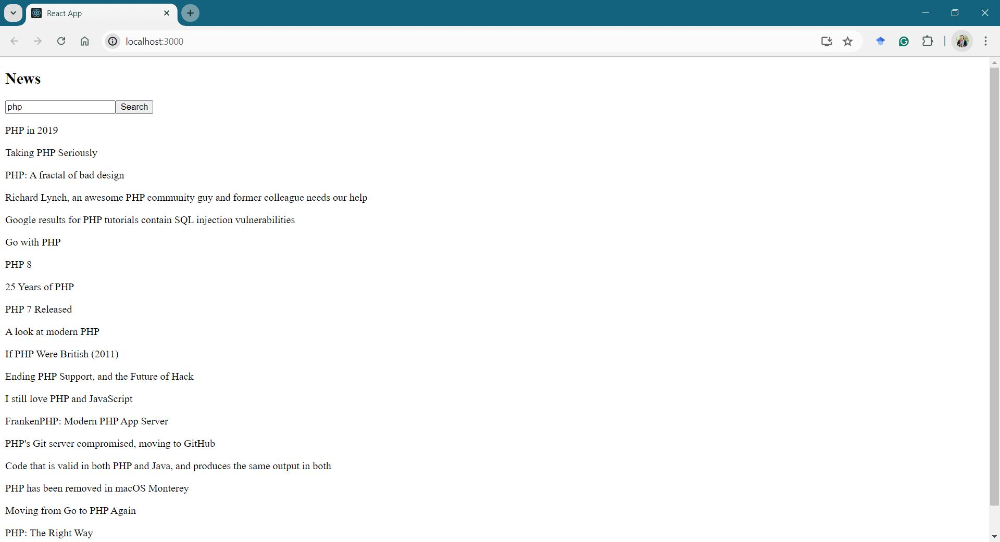

## Controlling useEffect's behaviour

In this section, we will modify our Hacker News client to fetch news articles only when the user submits a search query by hitting the "Search" button, instead of making an API request on each keystroke. This approach reduces unnecessary API calls and improves efficiency and enhances the user experience by ensuring that API calls are made only when needed, and not on every keystroke, making the application more efficient and responsive.

The form submission is now handled by the `handleSubmit` method, which prevents the default behavior and sets the URL state with the user input.
The `url` state is updated based on the user's search query. This state change triggers the `useEffect` hook to fetch the news.
The `useEffect` hook runs the `fetchNews` method only when the URL state changes, which happens when the user submits the form.
By updating the URL state only on form submission, we reduce unnecessary API requests made on each keystroke, improving performance.

1. First add form submission handling. Implement the `onSubmit` method for the form. 
2. State for managing URL is configured next.
3. To handle form submission, create a method which also updates the URL state, and prevents the default form behavior:
4. Next, modify `useEffect` hook to run based on changes to the URL state instead of the search query.
5. Update fetchNews method to ensure the `fetchNews` method uses the dynamic URL state.

Final Code:

```javascript
import React, { Component, useState, useEffect } from "react";

const App = () => {
  // state
const [news, setNews] = useState([])
const [searchQuery, setSearchQuery] = useState('react')
const [url, setUrl] = useState('http://hn.algolia.com/api/v1/search?query=react')

// fetch news
const fetchNews = () => {
  fetch(url)
    .then(result => result.json())
    // .then(data => console.log(data));
    .then(data => setNews(data.hits))
    .catch(error => console.log(error));
};

useEffect(() => {
  fetchNews();
}, [url])

const handleChange = (e) => {
  setSearchQuery(e.target.value)
}

const handleSubmit = e => {
  e.preventDefault()
  setUrl(`http://hn.algolia.com/api/v1/search?query=${searchQuery}`)
}

return(
  <div>
    <h2>News</h2>
    <form onSubmit={handleSubmit}>
      <input type="text" value={searchQuery} onChange={handleChange}/>
      <button>Search</button>
    </form>
    {news.map((n, i) => (
      <p key={i}>{n.title}</p>))}

  </div>
)

};

export default App;
```

## Loading

Here, we enhance our Hacker News client by adding a loading indicator to provide a better user experience. The loading indicator will show while the data is being fetched from the API, and disappear once the data is available. 

1. For this upgrade we only need to add few code lines. The a new state should be added to manage the loading state. 
2. The `fetchNews` method should be updated with the loading status before and after the data is available. 
3. At last, the loading status should be indicated in the client interface. 

The changed code is as follows. 

```js
import React, { Component, useState, useEffect } from "react";

const App = () => {
  // state
const [news, setNews] = useState([])
const [searchQuery, setSearchQuery] = useState('react')
const [url, setUrl] = useState('http://hn.algolia.com/api/v1/search?query=react')
const [loading, setLoading] = useState(false)

// fetch news
const fetchNews = () => {
  //set loading here
  setLoading(true)
  fetch(url)
    .then(result => result.json())
    // .then(data => console.log(data));
    .then(data => (setNews(data.hits), setLoading(false)))
    .catch(error => console.log(error));
};

useEffect(() => {
  fetchNews();
}, [url])

const handleChange = (e) => {
  setSearchQuery(e.target.value)
}

const handleSubmit = e => {
  e.preventDefault()
  setUrl(`http://hn.algolia.com/api/v1/search?query=${searchQuery}`)
}

return(
  <div>
    <h2>News</h2>
    {loading ? <h2>Loading...</h2> : ""}
    <form onSubmit={handleSubmit}>
      <input type="text" value={searchQuery} onChange={handleChange}/>
      <button>Search</button>
    </form>
    {news.map((n, i) => (
      <p key={i}>{n.title}</p>))}

  </div>
)

};

export default App;
```

The output of the above chnage is visible for very small time as below. 

Output:

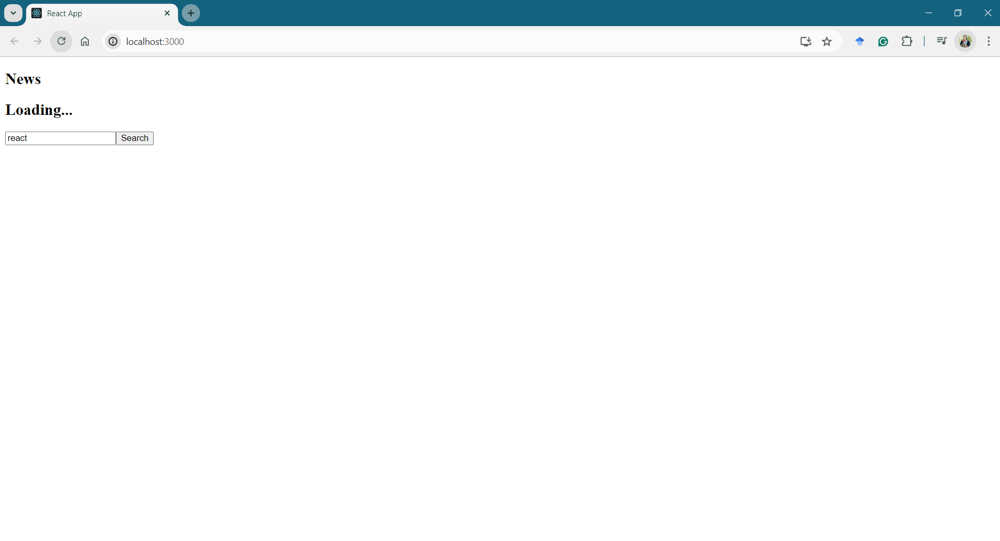

## Code organization

The code is rearranged with the help of hooks.

```js
import React, { Component, useState, useEffect } from "react";

const App = () => {
  // state
const [news, setNews] = useState([])
const [searchQuery, setSearchQuery] = useState('react')
const [url, setUrl] = useState('http://hn.algolia.com/api/v1/search?query=react')
const [loading, setLoading] = useState(false)

// fetch news
const fetchNews = () => {
  //set loading here
  setLoading(true)
  fetch(url)
    .then(result => result.json())
    // .then(data => console.log(data));
    .then(data => (setNews(data.hits), setLoading(false)))
    .catch(error => console.log(error));
};

useEffect(() => {
  fetchNews();
}, [url])

const handleChange = (e) => {
  setSearchQuery(e.target.value)
}

const handleSubmit = e => {
  e.preventDefault()
  setUrl(`http://hn.algolia.com/api/v1/search?query=${searchQuery}`)
}

const showLoading = () => (loading ? <h2>Loading...</h2> : "")

const searchForm = () => (
  <form onSubmit={handleSubmit}>
    <input type="text" value={searchQuery} onChange={handleChange}/>
    <button>Search</button>
  </form>
)

const showNews = () => news.map((n, i) => (<p key={i}>{n.title}</p>)
)

return(
  <div>
    <h2>News</h2>
    {showLoading()}
    {searchForm()}
    {showNews()}
  </div>
)

};

export default App;
```