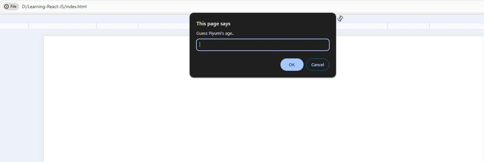
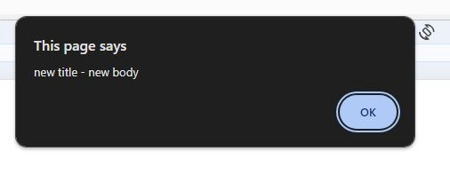

# Learning-React-JS

This repository contains the exercises done by me during the Udemy course "React JS Frontend Web Development for Beginners" by Ryan Dhungel. 

Link to the course is [here.](https://www.udemy.com/share/101rkI3@zMJhoBQX62DEpDKqhDh4Nq8DCl1wR1sLTXoIBZfNaJEtlFf0DKuzaPrA6jxET6DPOA==/)

## Modern Javascript

### Variable types

There are 2 variable types.
1. const
2. let

If the variable value is not to be changed overtime, the _const_ is to be used. Instead of `var name = 'Piyumi';` we can use `const name = 'Piyumi';` for the variable definition. 

```js
const name = 'Piyumi';
alert(name);
```

If the variable is only meant to be inside the scope that the variable has been defined, _let_ is being used. Below is an example. 

```js
if (true){
    var name = 'Piyumi';
}
alert(name)
```
Above code is works in javascript and pops out the name variable into the window. The variable can be accessed and valid inside the whole code. Below is the console image that to prove that the variable can be accessed from outside of the _if_ statement. 


If _let_ is used, the variable name is only accepted inside of the defined scope and the varibale name still can be used outside the defined statements. 

```js
if (true){
    let name = 'Piyumi';
    // alert(name);
}

alert(name);
```

Below image shows that the varibale cannot be accessed throught the _window_ which means that the variable is not valid outside the _if_ statement. 


### Template strings

Template strings are used as an alternative for _string concatenation_. Here, the lecturer shows the old way of string concatenation and using the template strings. 

```js
let fname = 'Piyumi';
let lname = 'W';
let age = prompt("Guess Piyumi's age..");

// //old way
// let result = fname + ' ' + lname + ' '+ 'is ' + age + ' ' + 'years old.';
// alert(result);

//template strings
let result = `${fname} ${lname} is ${age} years old.`;
alert(result);
```
This method is useful in situations where we have to call URLs and endpoints from APIs. Both ways gives the same result as shown in below images. 




### Default parameters

This is an option of ES6 update to passing deafult parameters to function arguments and more. 

Define the function as below at first with no default values. 

```js
function welcome(user, message){
    alert(`Hello ${user}, ${message}`)
}

welcome('Piyumi', 'Welcome!')
```

The output is something like below. 


The output is generated as expected. But, if we call the function with no arguments as in `welcome()`, the output is generated as below. 


To avoid this situation, we define some default parameters when defining the function. 

```js
function welcome(user="mystery user", message="Good bye!"){
    alert(`Hello ${user}, ${message}`)
}
// welcome('Piyumi', 'Welcome!')
welcome();
```

When the function is called with no arguments, the output is generated with the default values. 


### Arrow function

These are different from the regular functions. The sample regular function looks like below. 

```js
function greeting(message){
    return alert(`${message} everyone`);
}

greeting("Good morning");
```

The same function can be written as an _arrow function_ like below. 

```js
let greeting = message => alert(`${message} everyone`);

greeting("Good morning");
```

The output is same for both of the ways. 


When there is only one input arguments, _message_ can be used without the paranthesis _( )_. Below is an another example with multiple arguments and statements.

```js
let createBlog = (title, body) => {
    if (!title) {
        throw new Error('A title is required');
    }
    if (!body) {
        throw new Error('Body cant be empty');
    }
    
    return alert(`${title} - ${body}`);
};

createBlog('new title', 'new body');
```

The output for above code is as follows. 



If there are no arguments, the arrow function can be defined as below. 

```js
let greeting = () => alert(`Hello everyone`);

greeting();
```

### Arrow function and _this_ function

In JavaScript when we create a function they become a part of the global _window_ object and when you use _this_ keyword it refers to the enclosing context. Using _this_ keyword ensures that it refers to the function within the function within the two curly braces. Below is an example where the function has become a method inside of the _window_ object and how the keyword _this_ has been used to directly access the _window_ object. 

***Before: ***

```js
function sayHi(){
    //
}

```


The window is not directly logged in the console window unless we look for it using the console. 

```js
function sayHi(){
    //
}

console.log(this);
```


Here the _window_ is directly logged in the console and we can see the _sayHi_ function inside of it. 

The _this_ keyword should be used causiously. The contat of _this_ can be changed according to the place we out that into. Below examples shows how _this_ is acted accrding to the location and why it should not be used as such. 

```js
let nepal = {
    // add property
    mountains: ['Everest', 'Fish Tail', 'Annapurna'],

    // add method
    printWithDash: function() {
        console.log('Inside printWithDash', this)
        setTimeout(function() {
            // console.log(this.mountains.join(' - '))
            console.log('Inside setTimeout', this)
        }, 2000);
    }
}

nepal.printWithDash();
```


The definition of _this_ has been changed even though we used it inside the _nepal_ main object and same object _printWithDash_. This is where the usage of ***_arrow_*** function comes into the picture. Arrow function can help defining the keyword _this_ under a single whole function. 

```js
let nepal = {
    // add property
    mountains: ['Everest', 'Fish Tail', 'Annapurna'],

    // add method
    printWithDash: function() {
        // console.log('Inside printWithDash', this)
        setTimeout(() => console.log(this.mountains.join(' - ')), 2000)
            // console.log('Inside setTimeout', this)       
    }
}

nepal.printWithDash();
```


### Destructuring objects

This is a way of breaking down obects or arrays into variables. Below example shows how it works. 

```js
let thingsToDo = {
    morning: "Exercise",
    afternoon: "Work",
    evening: "Code",
    night: ["sleep", "dream"]
}

let {morning, afternoon} = thingsToDo; //object destructuring

console.log(morning, ' - ', afternoon)
```

The outout in the console shows that the _morning_ and _afternoon_ can be considered as seperate variables after the object destructuring.  


Below is a bit complex example.

**Method 1:**

```js
let uniStudent = student => {
    // let {name, university } = student;
    console.log(`${student.name} from ${student.university}`);
};

uniStudent({ 
    name: 'Piyumi',
    university: 'University of Oulu'
});
```

**Method 2:**

```js
let uniStudent = student => {
    let {name, university } = student;
    console.log(`${name} from ${university}`);
};

uniStudent({ 
    name: 'Piyumi',
    university: 'University of Oulu'
});
```

**Method 3:**

```js
let uniStudent = ({name, university }) => {
    console.log(`${name} from ${university}`);
};

uniStudent({ 
    name: 'Piyumi',
    university: 'University of Oulu'
});
```

All the methods generates the same output and the way of using can be selected as preferred. 

Output:


### Destructuring arrays

This is just like dealing with the destructuring objects in previous section. 

```js
// let [theMountain] = ['Everest', 'Fish Tail', 'Annapurna']; //choose the first element
// let [, theMountain] = ['Everest', 'Fish Tail', 'Annapurna']; //choose the second element
let [, , theMountain] = ['Everest', 'Fish Tail', 'Annapurna']; //choose the third element

console.log(theMountain)
```

The **' , '** defines the number of elements in the array that we need to skip. The output for each selection of the elements is as below. 


### Restructuring

